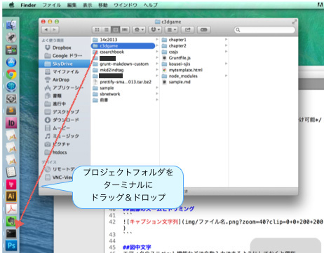
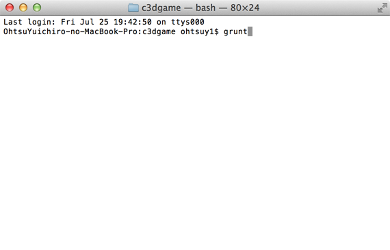
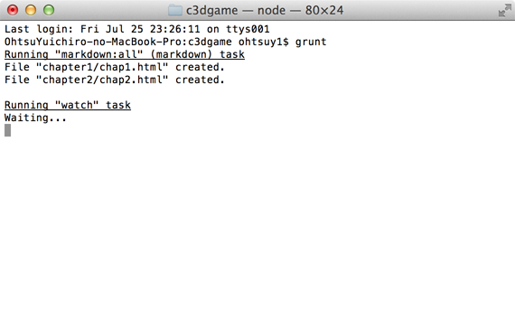
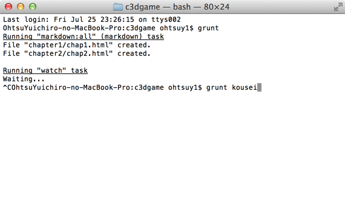
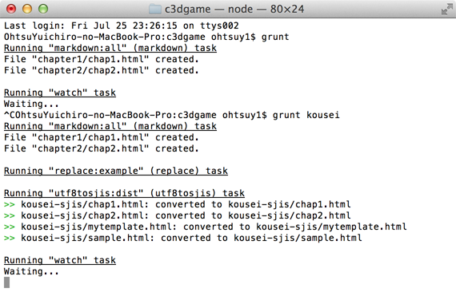
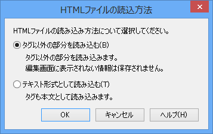
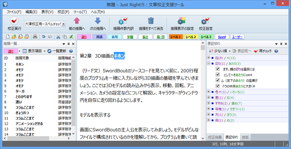

#原稿段階での校正のためのMarkdownワークフロー（注：社内用マニュアルです）
原稿段階でなるべく手軽にJust Rightをかけるにはどうしたらいいかを考えた結果、現状のMarkdownワークフローに、SJISコンバートしたHTMLを吐き出す工程を追加してみました。

設定さえすめば、mdファイルを保存すると自動的にプレビュー用のHTMLファイルと、Just Right用のShift JIS変換されたHTMLファイルが自動作成されます。


#インストール方法
##grunt-cliのインストール

最初に[Grunt](http://js.studio-kingdom.com/grunt/doc/getting_started)というものをインストールします。

Gruntはタスクランナーと呼ばれる簡単にいうと**バッチ処理ツール**で、「特定のフォルダ内のmdファイルが更新されたら、自動的にhtmlファイルを生成して、sjisにコンバート」といった連続処理を行えます。

インストール方法は、Macの場合はターミナルからこれを入力。

```bush
sudo npm install -g grunt-cli
```
Windowsの場合は[node.js](http://nodejs.org/download/)なるものをインストールしてから、sudo抜きでこれをコマンドプロンプトに入力。

```bush
npm install -g grunt-cli
```

##プロジェクトを作る
原稿データを保存するためのプロジェクトフォルダを作成します。なお、Macでは**日本語フォルダ**内にプロジェクトフォルダを作るとエラーになるので注意。日本語を含まないパスにフォルダを作成してください。

Gruntのプロジェクトは普通コマンドで作成するのですが、ちょっとややこしいので[ここ](https://github.com/lwohtsu/grunt-makdown-custom/archive/master.zip)からZIPファイルをダウンロードして解凍し、「cssjs」「node_modules」「Gruntfile.js」「mytemplate.html」の4つのフォルダ／ファイルをプロジェクト用フォルダにコピーしてください。


適当に章ごとに「chapter1」とかフォルダを作っておきます。

画像はこんな感じで保存しておくといいでしょう。


##Gruntを実行する
プロジェクト用フォルダをターミナルで開きます。ターミナルを起動してドックに表示させておき、ドラッグ＆ドロップすればOKです。



ターミナルが開くので**「grunt」**と入力してEnterを押します。



「Watching...」と表示されたら成功です。後はmdファイルを適当なエディタで編集し、上書き保存するだけで自動的にhtmlファイルが生成されます。



**mdファイルと同じフォルダ内**にUTF-8版のhtmlファイルが生成されるので、それをブラウザで開いておけば、その後もmdファイル保存時に自動更新されます。入力したMarkdownが間違っていないか、どういう仕上がりになるのかをチェックしながら原稿編集できて便利です。


現状はこれで生成されたHTMLファイルを、原稿＆指示ファイルとしてオペレータに送っているのですが、もう少し自動化できないのかというのが今後の課題（最新版ではXML変換してもう少し自動化しました）。

---

うまく起動しない場合は、日本語フォルダではないか、他にターミナルのウィンドウでGruntが動いていないかをチェックしてください。動いていたら「Control＋C」で終了します。

Gruntを複数実行しても本来は問題ないのですが、ブラウザを自動更新するためのこのプロジェクトの場合livereloadのポート番号を当たってしまうため、Gruntfile.jsを編集してプロジェクトごとに変える必要があります（その説明がちょっとややこしいので、同時に複数開かないほうがいいという話）。


##Just Rightで文字校する
SJIS変換を常に実行するとかなり重いので、普段はUTF-8のファイルだけ自動更新し、ターミナルから「grunt kousei」と入力したときだけSJIS変換ファイルを書き出すようにしました。

すでにGruntを実行している場合は「Control+C」で停止し、**「grunt kousei」**と入力してEnterを押します。



次のように「Running "utf8sjis:dist"……」と表示されるようになればOKです。


プロジェクトフォルダ直下の「kousei-sjis」フォルダにSjift-JIS変換済みのHTMLファイルが保存されます。


Just RightがLenovoのノートにしか入っていないので、校正したいときは「kousei-sjis」フォルダ内のhtmlファイルを共有フォルダにコピーします。


Lenovoのノートに切り替えて、Just Rightを起動して［ファイル］メニューから［HTMLファイルを開く］を選択し、校正したいファイルを選択します（ウィンドウにドラッグ＆ドロップしてもOK）。


「タグ以外の部分を読み込む」を選択して［OK］ボタンをクリックします。


後は［校正実行ボタン］をクリックして校正します。やり方はInDesignプラグイン版とだいたい一緒です。



#Markdownについて
Markdownはテキストに記号を入れて「md」という拡張子で保存したテキストファイルのことです。従来も「行頭に■■を入れたら大見出し」といった独自のルールを作って原稿を書くのが一般的でしたが、それと同じです。

その都度ルールを決めるよりはMarkdownに従ったほうが、いろいろと便利なツールが使えて便利という話です。

Markdownのルールについては[ここ](../sample/sample.md)に参考ファイルを入れたので、それを参照してください。

#プレビューのカスタマイズ
cssjsというフォルダ内にmyrule.cssというファイルがあり、これを編集することでプレビューの見た目を変えることができます。
